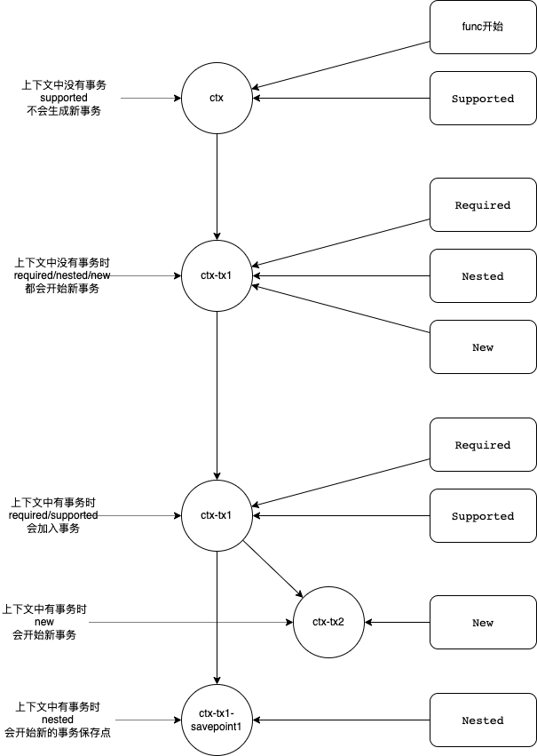

# go-ctx-tx

通过context.Context控制事务行为

## Installation

    go get github.com/fmyxyz/ctx-tx@latest

## Overview

已实现的事务行为:

1. Required 没有事务时创建，有事务时加入
2. Supported 有事务时加入
3. Nested 没有事务时创建，有事务时嵌套
4. New 总是新建事务

#### 參考图



## Usage

```go

package main

import (
 "context"
 "database/sql"
 "log"

 tx "github.com/fmyxyz/ctx-tx"
 "github.com/fmyxyz/ctx-tx/std"

 _ "github.com/go-sql-driver/mysql"
)

func main() {
 db, err := openDB()
 if err != nil {
  log.Fatal(err)
 }
 std.Register(db)

 err = tx.WithTx(context.Background(), func(ctx context.Context) error {
  db := std.FromContext(ctx)
  _, err := db.Exec("update item set qty=? where id=?", 1, 1)
  if err != nil {
   return err
  }
  return nil
 })
 if err != nil {
  log.Println(err)
 }
}

func openDB() (db *sql.DB, err error) {
 db, err = sql.Open("mysql", "root:root@tcp(127.0.0.1:3306)/test?charset=utf8mb4&parseTime=true&loc=Local")
 if err != nil {
  return nil, err
 }
 return db, nil
}

```

## 推荐使用 go1.18
## 相关项目
1. https://github.com/fmyxyz/ctx-tx-gorm
2. https://github.com/fmyxyz/ctx-tx-xorm
